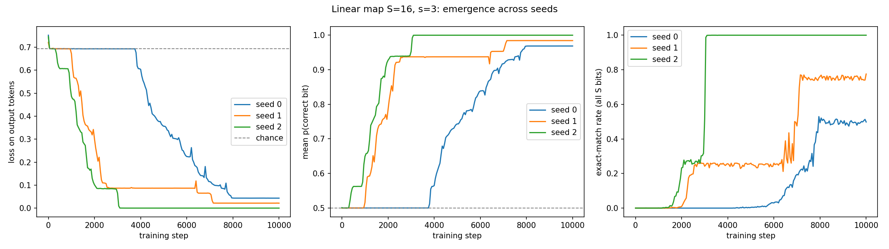
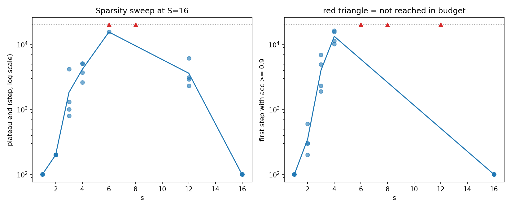
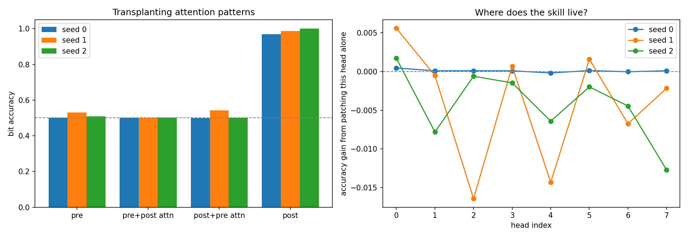
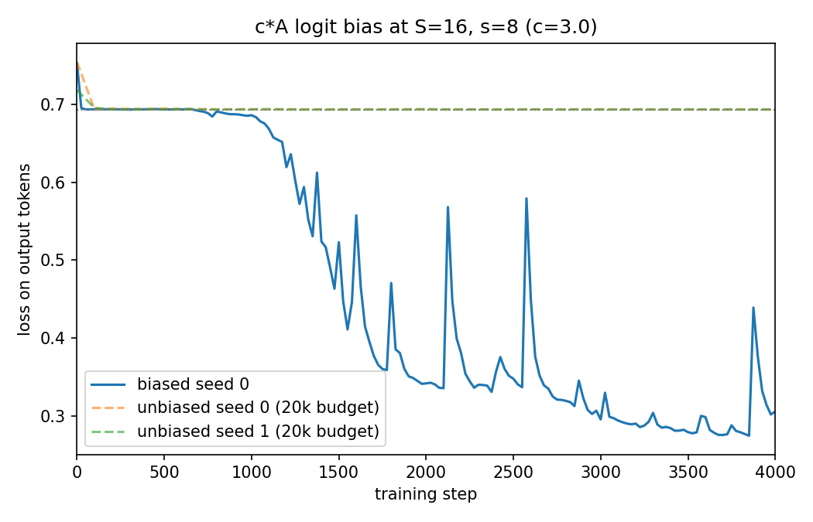
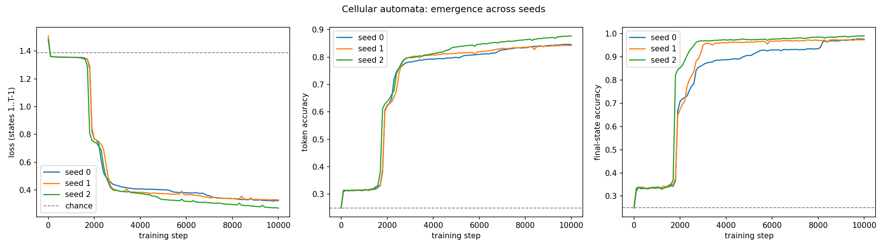
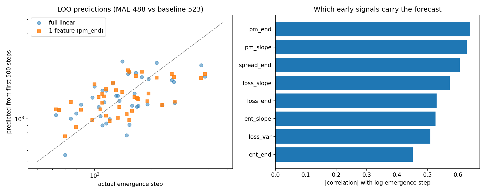

# attention-emergence

Reproduction and extension of **"Emergent Capabilities Arise Randomly from Learning Sparse Attention Patterns"** (Baherwani, Chen, Qiu, Wilson, Izmailov; NYU; [arXiv:2606.25010](https://arxiv.org/abs/2606.25010), June 2026).

The paper's central claim: emergent capabilities in transformers appear abruptly at unpredictable times across random seeds, and each jump coincides with the model suddenly learning a task-specific sparse attention pattern. This repo re-implements the paper's synthetic testbeds from scratch in PyTorch, reproduces its core results on a laptop CPU, and extends the analysis. Roadmap in [PLAN.md](PLAN.md); every detail the paper leaves unspecified is recorded in [ASSUMPTIONS.md](ASSUMPTIONS.md); environment fixes in [docs/SETUP.md](docs/SETUP.md).

Started 2026-07-22. No official or third-party implementation of this paper existed as of that date (re-verified 2026-08-01).

## Quickstart

```
pip install -r requirements.txt
python -m emergence.run_linear_map --seeds 3     # core emergence experiment
python -m emergence.run_sweeps --seeds 4         # difficulty sweeps (overnight)
python -m emergence.patch                        # attention transplant
python -m emergence.run_cellular --seeds 3       # cellular automata task
python -m emergence.pythia_eval                  # real-LM emergence (downloads)
```

## Results so far

### Emergence is abrupt and seed-random (paper Sec. 3.2)



Three identical single-layer transformers on the identical task, differing only in random seed. One snaps to 100% at step ~3,050, one emerges in two stages (15 of 16 output bits early, the last near step 7,000), one grinds and is still unfinished at 10,000 steps. Attention entropy collapses and attention mass on the true parent bits rises at each transition ([diagnostics](docs/figures/attention_diagnostics.png)).

### Difficulty laws (paper Sec. 3.2)



Plateau length versus sparsity is a hump spanning three orders of magnitude: trivial at s=1-2, censored at s=6-8 (most seeds never escape a 20,000-step budget), easy again at s=16 where the near-uniform newborn attention is already correct. The peak sits at s/S of roughly one half, matching the paper's joint s/S sweep, which reports ratios near 0.5 as maximally hard; a confirming ratio sweep at S=8 is running. The hump's shape is stable across plateau thresholds 0.55/0.60/0.65 ([threshold figure](docs/figures/threshold_sensitivity.png)). Versus state size, plateaus grow multiplicatively, roughly 100 / 1,900 / 9,000 steps for S=8/16/32 ([figure](docs/figures/size_sweep.png)), though note this axis varies the s/S ratio along with length; the S=8 ratio sweep addresses the confound. Second-order observation: plateau escape and task mastery decouple at medium-high sparsity (s=12 escapes the loss floor but never reaches 90% accuracy in budget; s=16 reaches 90% within 100 steps but converges slowly).

### The attention pattern is the search bottleneck, not the whole circuit (paper Sec. 2.2 and App. B.3)



Two experiments, opposite designs, and together they decompose the mechanism. First, ours: transplanting post-emergence attention into a late-plateau checkpoint **at inference** recovers nothing (accuracy stays ~0.50, unchanged when the patch is restricted to output-half queries and input keys and renormalized), while the reverse control destroys the trained model (~1.00 to ~0.50), and parameter-level component swaps show no proper subset of trained components restores the capability (0.90 without embeddings, 0.985 with all).



Second, the paper's App. B.3 intervention, which we replicate: adding c*A to the attention logits **during training**, so the correct pattern is present from step 0 but the readout remains free to learn, collapses the s=3 plateau from 800-4,200 steps to 150 and unlocks s=8 entirely: a setting where four unbiased seeds made zero progress in 20,000 steps reaches 79% accuracy within 4,000 biased steps. Net claim, corrected from an earlier version of this README after external review: the attention pattern is the bottleneck for the *search*, and the downstream readout is trainable once the pattern is present, but it is not free. Two measured caveats the paper does not state: the biased s=8 model stays at chance for 3,000 steps at our assumed lr of 1e-3 across c in {1, 3, 10} and only converges with hotter hyperparameters (lr 3e-3, batch 1024), so B.3's "almost instantly" is hyperparameter-sensitive (ASSUMPTIONS #1, #15); and a transplanted pattern cannot rescue a frozen pre-emergence readout, so pattern and readout must co-train even though the readout is the cheaper half.

### In-context rule inference emerges too (paper Sec. 3.3)



The cellular automata task (4 colors, 256 candidate local rules, the model must infer which rule generated the trajectory and then apply it). All three seeds plateau just under chance, cliff near step 1,800, then diverge in how fast they consolidate (final-state accuracy 97% by step 3,000 for the fastest seed versus a grind to 90% over 8,000 for the slowest). By the end, heads concentrate up to 97% of their attention exactly on each cell's three upstream neighbors ([parent-mass figure](docs/figures/ca_parent_mass.png)): the model discovers the locality of the physics. Overall token accuracy saturates near 84% for a structural reason: early states of each sequence are unpredictable before the trajectory has revealed which rule is operating, so the gap between overall and final-state accuracy is the in-context inference itself.

### Real language models (paper Sec. 2)

Emergence step per capability across Pythia sizes (suite accuracy >= 0.75, binary-searched over public training snapshots; null = never within 143k steps):

| Capability | 14M | 70M | 160M |
|---|---|---|---|
| Induction | 5,000 | 12,000 | 1,000 |
| Numbered lists | 19,000 | 2,000 | 2,000 |
| Copying | never | never | 8,000 |
| Indirect object identification | never | never | 16,000 |

Copying and IOI are scale-gated: absent at 14M and 70M, switching on within 160M's training run. That presence/absence pattern is well-supported. Cross-size *timing* comparisons are not: this table is one public training run per size (the paper uses ten seeds per scale precisely because timing scatter is wide), and induction's 5,000 / 12,000 / 1,000 sequence is a single non-monotone draw per cell, not a trend. Per-seed Pythia variants are the natural follow-up and are deferred (ASSUMPTIONS #14).

### Extension: emergence has foreshocks, with a scaling caveat (original work)



Across 40 training runs of a fixed task (S=12, s=3), statistics computed from **only the first 500 steps** forecast each run's eventual emergence step: leave-one-out correlation r = 0.57 (Spearman 0.52), a 10.4% MAE improvement over predicting the mean, from a one-feature linear model whose feature (attention mass already sitting on the true parent positions) is selected inside each fold. No run had emerged by step 500, and attention-based features (r up to 0.56) outrank loss-based features (r up to 0.48) at the same window: the gaze moves before the loss does, and how far it has moved carries timing information. A permutation test over the entire pipeline, in-fold feature selection included, puts this at p = 0.008 (1,000 label shuffles). No runs were dropped on the outcome: all 40 source and all 15 transfer runs emerged within budget (the code reports the count, and a censored-rank treatment is specified for any future fleet where it is nonzero).

The limit is as informative as the signal. Fit on s=3 and applied to 15 runs of the harder s=4 task at the same fixed window, the predictor transfers at r indistinguishable from zero. Diagnosis: forecast horizons scale with task difficulty. Step 500 is 40-80% of a typical s=3 plateau but only 10-20% of an s=4 plateau, and within s=4 the in-domain signal strengthens from r = 0.26 at step 500 to r = 0.78 at step 2,000 (still fully pre-emergence, earliest label 2,375). Early warning exists, but its clock ticks in units of the task's own plateau length, not in raw steps. A difficulty-normalized or fully sequential predictor is the natural next question, noted in PLAN.md. Caveats stated plainly: n = 15 in the transfer set, one architecture, one task family.

## Layout

```
emergence/
  linear_map.py     task: x1 = A x0 (mod 2), s-sparse rows
  model.py          minimal transformer with inspectable, overridable attention
  train.py          training loop, emergence metrics, checkpointing, early stop
  run_linear_map.py multi-seed emergence experiment + figures
  run_sweeps.py     difficulty sweeps with censoring-aware plateau stats
  patch.py          attention transplant + component-swap surgery
  cellular.py       cellular automata task (in-context rule inference)
  run_cellular.py   CA experiment runner
  pythia_eval.py    emergence localization in Pythia checkpoints
  run_bias.py       c*A logit-bias intervention (App. B.3 replication)
  run_heads.py      head-count scaling (Sec. 4.2)
  run_fleet.py      cheap-run fleets for the early-warning study
  predict.py        early-warning predictor + permutation test + transfer
  replot_sweeps.py  threshold sensitivity for the sparsity hump
  test_indexing.py  sanity tests for task math, index alignment, metrics
docs/               setup notes, promoted figures, small result JSONs (docs/data)
results/            full run outputs (gitignored)
```

## Status

| Step | State |
|------|-------|
| 1. Repo scaffold | done |
| 2. Linear-map emergence experiment | done |
| 3. Sparsity / state-size sweeps | done; both scaling claims reproduced |
| 4. Attention patching + B.3 bias replication | done; pattern is the search bottleneck, readout co-trains |
| 5. Cellular automata task | done |
| 6. Pythia checkpoint analysis | done |
| 7. Writeup | done |
| 8. Extension: emergence early-warning | done; in-domain r=0.57 (perm p=0.008), transfer requires difficulty-scaled windows |
| 9. Architecture (paper Sec. 4): head-count sweep | running |
